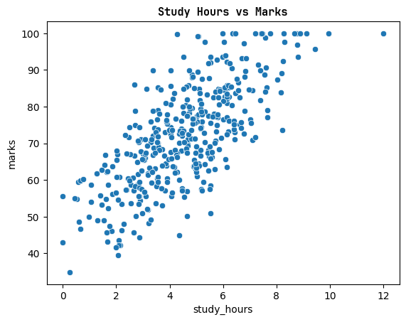
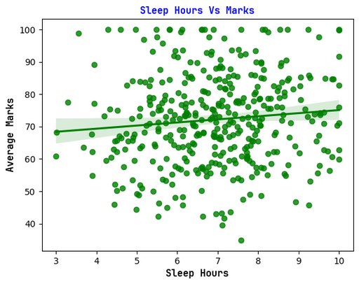
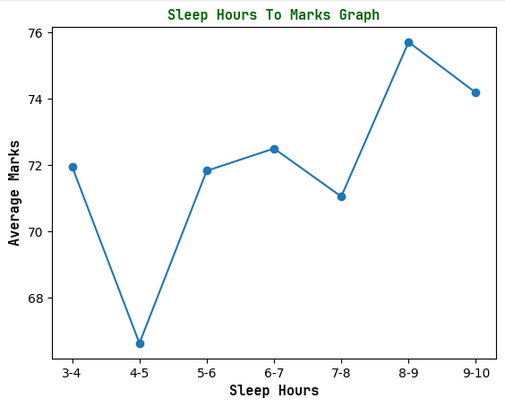

# Student Performance Analyzer
An intuitive data analysis tool that visualizes student grades, tracks academic trends, and uncovers actionable insights to help educators identify learning gaps and optimize classroom performance.

## Study vs. Performance

**__Does an increase in study hours uniformly correspond to higher marks across all echelons?__**

**Study hours seem to positively affect student grades.**
As observed from the above graph, when study hours go up the marks achieved are also generally high. We can also see a pattern where to achieve a 100 marks, the minimum threshold for study hours seems to be 4 hours.

In short terms, to achieve 100 marks , a student must atleast have studied 4 hours according to the current sample.

5 to 7 hours of study seems to be the sweet spot, where anything lower would cause a significant drop on the marks achieved, and anything more would have minimal effect on the final marks.

## Sleep vs. Performance
**__Do higher sleep duration values demonstrate a positive linear relationship with final scores?__**

**Sleep hours seem to have little to no effect on student grades**

As astonishing as it sounds, according to the given research, sleep hours have little effect on student grades as seen in the above chart. This might be due to other factors influencing the overall result such as the students who sleep few hours, around 4-5 hours may make up for that in terms of study hours.

The point is, less sleep hours but higher study hours could be the cause for this astonishing discovery. However, this is just a hypothesis currently.

**The boundaries of the optimal student performance sleep range**

As we know, sleep hours have a very little effect on marks. However, for the sole purpose for answering the question. 8-9 hours of sleep seem to be the most optimal yiedling the highest average marks of **75.71** or 76.

Here are the actual figures:.
3-4 hours     71.955000 
4-5 hours     66.629375 
5-6 hours     71.831692 
6-7 hours     72.503402 
7-8 hours     71.053981 
8-9  hours    75.713273 
9-10 hours    74.184737 
