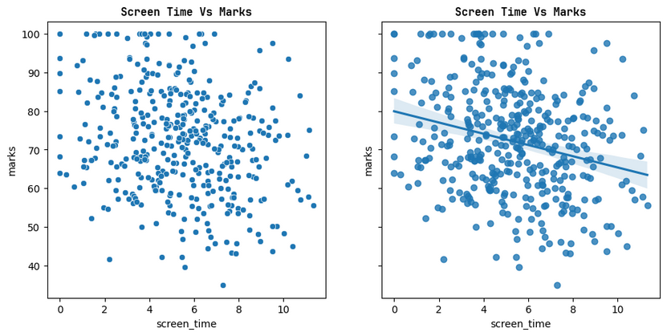
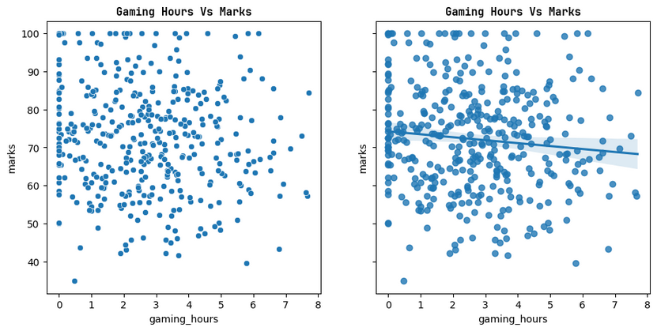
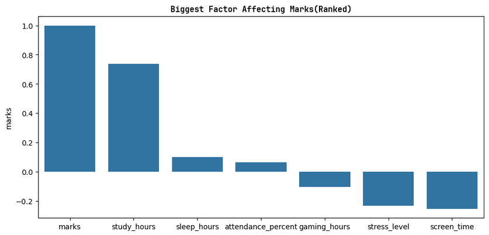
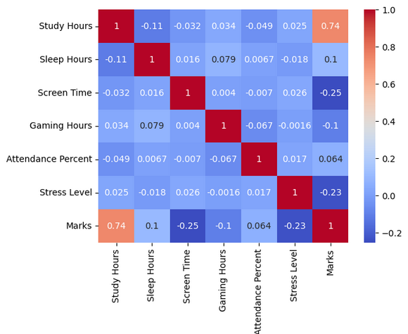
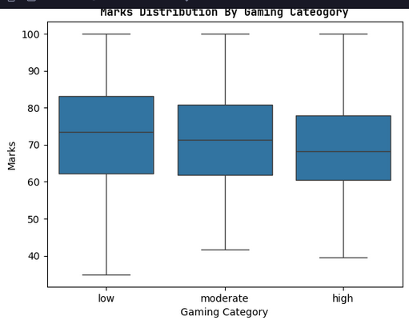
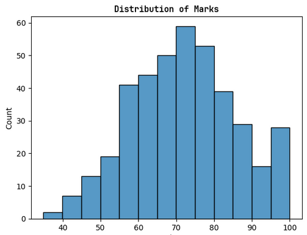

# Student Performance Analyzer
An intuitive data analysis tool that visualizes student grades, tracks academic trends, and uncovers actionable insights to help educators identify learning gaps and optimize classroom performance.

## Project Overview

### Prerequisites
1.) **Python 3.11.2 (or newer)**  
2.) **pandas** --> for analyzing and handling the dataset  
3.) **matplotlib** --> for plotting and visualizing the data  
4.) **seaborn** --> for more complex plots i.e regression plots, joint plots, etc  
5.) **scikit-learn** --> for predictive modeling and model evaluation  
6.) **Jupyter Notebook** (or any relevant software)

### Installation

1.) **Clone the repository**  
```bash
git clone https://github.com/mrjaykayy/student-analysis.git
```

2.) **Change Working Directory**  
```bash
cd student-analysis.git
```

3.) **Install the required dependencies**  
```bash
pip install -r requirements.txt
```

4.) **Open the notebook** (`.ipynb`)

5.) **Restart kernel and run all cells**

---

# Exploratory Data Analysis (EDA)

## Study vs. Performance

### **Does an increase in study hours uniformly correspond to higher marks across all echelons?**


**Study hours appear to be the strongest predictor of student grades within this dataset.**

As observed from the graph, higher study hours are generally associated with higher marks. Students studying more tend to achieve higher scores, while students studying fewer hours display a much wider range of outcomes.

Students scoring close to 100 marks typically studied at least 4 hours according to the available sample. This should be interpreted as an observation from the dataset rather than a universal requirement.

A noticeable trend emerges between 5 and 7 study hours, where marks increase substantially compared to lower study durations. Beyond this range, average performance continues to improve but at a slower rate. This suggests the possibility of **diminishing academic returns**, where additional study time still contributes positively but with reduced effectiveness.

### Key Findings

- Positive relationship between study hours and marks.
- Highest correlation with marks among all analyzed variables.
- Evidence suggests diminishing returns beyond approximately 7 study hours.
- Study hours appear to exert the greatest influence on academic performance.

---

## Sleep vs. Performance

### **Do higher sleep duration values demonstrate a positive linear relationship with final scores?**


**Sleep duration exhibits only a weak relationship with student grades within this dataset.**

The calculated correlation between sleep hours and marks is approximately **0.10**, indicating a very weak positive association.

Although a slight upward trend exists, the relationship is not strong enough to conclude that sleep duration alone substantially influences academic performance. Other variables such as study habits, stress levels, and screen time may be interacting with sleep duration and influencing outcomes.

It is important to note that a weak correlation does not imply sleep is unimportant. Rather, it suggests that sleep duration by itself is not a strong predictor of marks in this particular sample.

### Correlation

**Sleep Hours vs Marks:** `0.10`

### Interpretation

Students sleeping fewer hours may compensate through increased study time, while students sleeping more may not necessarily utilize their waking hours effectively. These competing factors may partially explain the weak relationship observed.

---

### The Boundaries of the Optimal Student Performance Sleep Range


Although the overall relationship between sleep duration and grades is weak, students sleeping between **8 and 9 hours** achieved the highest average marks in the dataset.

This does not establish an optimal biological sleep requirement, but rather identifies the sleep range associated with the highest average academic performance within the sample.

### Average Marks by Sleep Range

| Sleep Range | Average Marks |
|------------|---------------|
| 3–4 Hours | 71.96 |
| 4–5 Hours | 66.63 |
| 5–6 Hours | 71.83 |
| 6–7 Hours | 72.50 |
| 7–8 Hours | 71.05 |
| 8–9 Hours | 75.71 |
| 9–10 Hours | 74.18 |

### Key Findings

- Weak positive correlation.
- Sleep duration alone is not a strong predictor of marks.
- Highest average performance occurred in the 8–9 hour range.
- Other factors likely play a larger role in determining academic outcomes.

---

## Screen Time vs. Performance

### **How does aggregate screen time interact with grade outcomes?**



**Screen time exhibits a moderate negative relationship with academic performance.**

Students with higher screen time generally tend to achieve lower marks. While the relationship is not extremely strong, the overall trend suggests that excessive screen usage may reduce study time, concentration, or overall productivity.

The regression line demonstrates a negative slope, indicating decreasing marks as screen time increases.

### Correlation

**Screen Time vs Marks:** `-0.2533`

### Interpretation

The relationship is not perfectly linear, but the overall direction remains negative. Screen time may also interact indirectly with other factors such as stress levels, sleep quality, and study habits.

### Key Findings

- Negative relationship with marks.
- Stronger effect than sleep duration.
- Potential indirect influence through multiple lifestyle factors.
- Higher screen time is generally associated with lower academic performance.

---

## Gaming Hours vs. Performance

### **Does gaming duration exhibit a direct, strong downward pull on grades, or does it serve as an indirect factor operating through secondary variables such as stress or sleep depletion?**



Gaming duration demonstrates a **weak negative association** with academic performance.

The regression line shows a slight downward trend, but the data points remain widely scattered. This suggests that gaming hours alone are not a strong predictor of student grades.

### Correlation

**Gaming Hours vs Marks:** `-0.1026`

### Interpretation

Based on correlation analysis alone, it is not possible to determine whether gaming affects grades directly or indirectly through variables such as stress, sleep, or study habits.

Additional statistical techniques such as mediation analysis or multiple regression would be required to answer that question conclusively.

The current evidence only supports the conclusion that higher gaming hours are weakly associated with lower marks.

### Key Findings

- Weak negative relationship.
- Relationship is substantially weaker than study hours or screen time.
- Current analysis cannot establish causation.
- Further investigation would be required to identify indirect effects.

---

## Other Observations

### **When evaluated concurrently, which singular lifestyle asset or risk factor exercises the highest variance control over student grades?**



The Bar Graph provides a high-level overview of relationships between all numerical variables.

Among all analyzed features, **Study Hours** exhibit the strongest relationship with marks, making it the most influential variable observed in the dataset.

### Variable Influence Ranking

Based on absolute correlation strength with marks:

| Rank | Variable | Relative Influence |
|--------|----------|-------------------|
| 1 | Study Hours | Very High |
| 2 | Stress Level | Moderate |
| 3 | Screen Time | Moderate |
| 4 | Gaming Hours | Low |
| 5 | Sleep Hours | Very Low |

### Key Findings

- Study hours dominate all other variables.
- Lifestyle factors influence performance but with weaker effects.
- Academic habits appear more predictive than entertainment-related variables.
- Correlation does not imply causation.

---

# Relevant Graphs And Plots
<br>
`A comprehensive heatmap showcasing the correlation between every numeric variable in the dataset`<br>

<br>
`A comprehensive boxplot showcasing the distribution between gaming usage aligned with marks obtained  in the dataset`<br>

<br>
`A comprehensive histogram showcasing the distribution of marks in the dataset`<br>


# Limitations

Several limitations should be considered when interpreting these findings:

1. Correlation does not imply causation.
2. The dataset represents only the available sample and may not generalize to all students.
3. Unobserved variables such as socioeconomic factors, teaching quality, motivation, and prior academic ability were not included.
4. Relationships may be nonlinear and therefore not fully captured by simple correlation analysis.
5. Additional statistical testing would be required to validate the significance of observed trends.

---

# Conclusion

This analysis explored the relationships between several lifestyle and behavioral factors and student academic performance.

Among all variables examined, **Study Hours** emerged as the strongest predictor of marks, demonstrating a clear positive relationship with academic achievement. Evidence also suggests diminishing returns after moderate study durations, where additional study time continues to help but at a reduced rate.

**Sleep Duration** showed only a weak relationship with grades, although students sleeping between 8 and 9 hours achieved the highest average marks in the sample.

**Screen Time** demonstrated a moderate negative association with academic performance, suggesting that excessive screen usage may negatively affect academic outcomes either directly or indirectly.

**Gaming Hours** exhibited only a weak negative relationship with grades, and the current analysis does not provide sufficient evidence to determine whether its effects are direct or mediated through other variables.

Overall, the findings indicate that academic habits, particularly study time, play a substantially larger role in determining student performance than the lifestyle variables analyzed. Future work involving predictive modeling, hypothesis testing, and advanced statistical analysis could provide deeper insights into the factors driving academic success.
